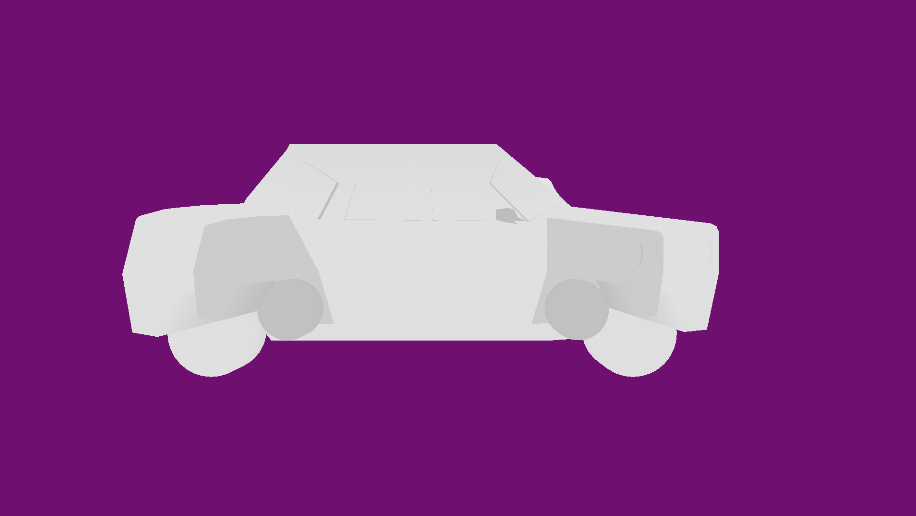

# Rasterization creative task
## Short description
### Add other models
I added multiple models but they are all very complicated
and to understand what we see on the screen we need shadows which we don't currently have

So I looked for a simple model just to see if and how the code works at this stage.

I found these models

First one is a model of a sedan car
(It lies in `models/car/car_sedan.obj`)
The file is pretty clean which enables us to see that both the engine and the model work.

https://plugins.qgis.org/wavefronts/25/

There's also this model of Tardis from Doctor Who:

https://plugins.qgis.org/wavefronts/23/

### Add some depth to the rendered picture
To quickly visualize depth in this engine, I just multiplied the color components with the z value
like this:

```c
	rasterizer->pixel_shader = [](cg::vertex vertex_data, float z) {
		return cg::color{
				vertex_data.ambient_r * z,
				vertex_data.ambient_g * z,
				vertex_data.ambient_b * z};
```

This method does not correctly add shadows but it gives some perception of depth nevertheless.

But when I looked at the result, nothing changed.
This is because the model was either too far from the camera or too close to it.
And so the color would always be monochrome white.

I looked at the model itself and noticed it had negative coordinates.
So, naturally, I moved the far and near planes using camera_z_near and camera_z_far parameters
to be closer to these coordinates in the obj file.

It could be done through argv parameters but I changed it in the default settings options
to these values: `{ near: -3.0, far: 3.0 }`

This is what I managed to get in doing so:

